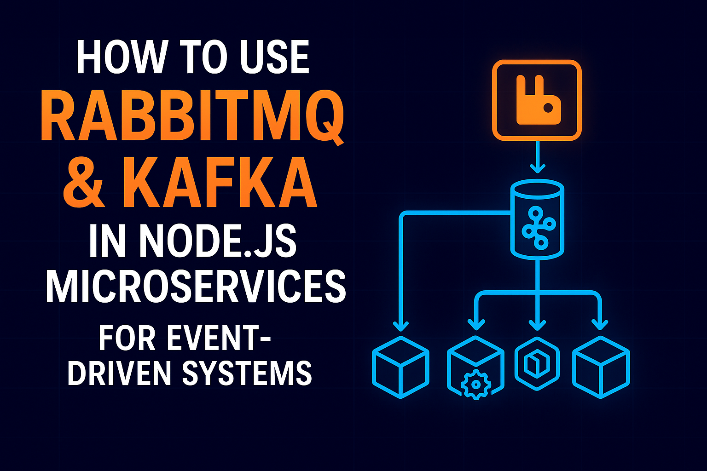

[](https://github.com/jmrashed/rabbitmq-kafka-node-demo/stargazers)
[](https://github.com/jmrashed/rabbitmq-kafka-node-demo/actions)

# RabbitMQ & Kafka Node.js Demo

A comprehensive demonstration of message queuing with RabbitMQ and Apache Kafka using Node.js, featuring Docker containerization and REST API endpoints.


## 🚀 Features

- **RabbitMQ Integration**: Producer and consumer services with queue management
- **Apache Kafka Integration**: Topic-based messaging with consumer groups
- **REST API**: HTTP endpoints for message production
- **Docker Compose**: Full-stack containerized environment
- **Health Checks**: Service health monitoring
- **Example Scripts**: Ready-to-use demonstration scripts
- **Load Testing**: Performance testing capabilities

## 📋 Prerequisites

- Docker and Docker Compose
- Node.js 18+ (for local development)
- Git

## 🛠️ Quick Start

### Using Docker (Recommended)

1. **Clone the repository**:
   ```bash
   git clone https://github.com/jmrashed/rabbitmq-kafka-node-demo.git
   cd rabbitmq-kafka-node-demo
   ```

2. **Start all services**:
   ```bash
   docker-compose up -d
   ```

3. **Check service health**:
   ```bash
   docker-compose ps
   ```

### Local Development

1. **Install dependencies**:
   ```bash
   npm install
   ```

2. **Start infrastructure services**:
   ```bash
   docker-compose up -d rabbitmq kafka zookeeper
   ```

3. **Run the application**:
   ```bash
   npm run dev
   ```

## 🔧 Services & Ports

| Service | Port | Management UI |
|---------|------|---------------|
| Node.js App | 3000 | - |
| RabbitMQ | 5672 | http://localhost:15672 |
| RabbitMQ Management | 15672 | guest/guest |
| Kafka | 9092 | - |
| Zookeeper | 2181 | - |

## 📡 API Endpoints

### Send Messages

**POST** `/produce`

#### RabbitMQ Message
```bash
curl -X POST http://localhost:3000/produce \
  -H "Content-Type: application/json" \
  -d '{
    "type": "rabbitmq",
    "queue": "task_queue",
    "message": "Hello RabbitMQ!"
  }'
```

#### Kafka Message
```bash
curl -X POST http://localhost:3000/produce \
  -H "Content-Type: application/json" \
  -d '{
    "type": "kafka",
    "topic": "task_logs",
    "message": "Hello Kafka!",
    "key": "log-key-1"
  }'
```

## 🎯 Example Scripts

Run the provided example scripts to test the system:

```bash
# Send a RabbitMQ message
node examples/send-rabbitmq.js

# Send a Kafka message
node examples/send-kafka.js

# Run load test (default: 10 messages each)
node examples/load-test.js

# Run load test with custom count
node examples/load-test.js 50
```

## 🧪 Testing

Run the test suite:
```bash
npm test
```

## 📊 Monitoring

### RabbitMQ Management UI
- URL: http://localhost:15672
- Username: `guest`
- Password: `guest`

### Docker Logs
```bash
# View all logs
npm run docker:logs

# View specific service logs
docker-compose logs -f app
docker-compose logs -f rabbitmq
docker-compose logs -f kafka
```

## 🏗️ Project Structure

```
├── config/                 # Configuration files
│   ├── kafka.js           # Kafka configuration
│   ├── logger.js          # Winston logger setup
│   └── rabbitmq.js        # RabbitMQ configuration
├── services/              # Core services
│   ├── consumer/          # Consumer implementations
│   ├── producer/          # Producer implementations
│   ├── consumer-service.js
│   └── producer-service.js
├── examples/              # Example scripts
│   ├── send-rabbitmq.js   # RabbitMQ example
│   ├── send-kafka.js      # Kafka example
│   └── load-test.js       # Load testing
├── test/                  # Test files
├── docker-compose.yml     # Docker services
├── Dockerfile            # App container
└── README.md
```

## 🔄 Development Workflow

### Start Development Environment
```bash
npm run docker:up
npm run dev
```

### Stop Services
```bash
npm run docker:down
```

### View Logs
```bash
npm run docker:logs
```

## 🚀 Production Deployment

1. **Build production image**:
   ```bash
   docker build -t rabbitmq-kafka-app .
   ```

2. **Deploy with production compose**:
   ```bash
   docker-compose -f docker-compose.yml up -d
   ```

## 🤝 Contributing

1. Fork the repository
2. Create a feature branch: `git checkout -b feature/new-feature`
3. Commit changes: `git commit -am 'Add new feature'`
4. Push to branch: `git push origin feature/new-feature`
5. Submit a pull request

## 📝 License

This project is licensed under the MIT License - see the [LICENSE](LICENSE) file for details.

## 🆘 Troubleshooting

### Common Issues

**Services not starting**: Check Docker daemon is running
```bash
docker --version
docker-compose --version
```

**Port conflicts**: Ensure ports 3000, 5672, 9092, 15672, 2181 are available
```bash
netstat -an | findstr "3000\|5672\|9092\|15672\|2181"
```

**Connection refused**: Wait for services to be healthy
```bash
docker-compose ps
```

### Health Checks

All services include health checks. Wait for all services to show "healthy" status before testing.

## 📈 Performance Notes

- RabbitMQ: Optimized for reliable message delivery
- Kafka: Optimized for high-throughput streaming
- Both support clustering for production scalability

---

**Made with ❤️ by [jmrashed](https://github.com/jmrashed)**